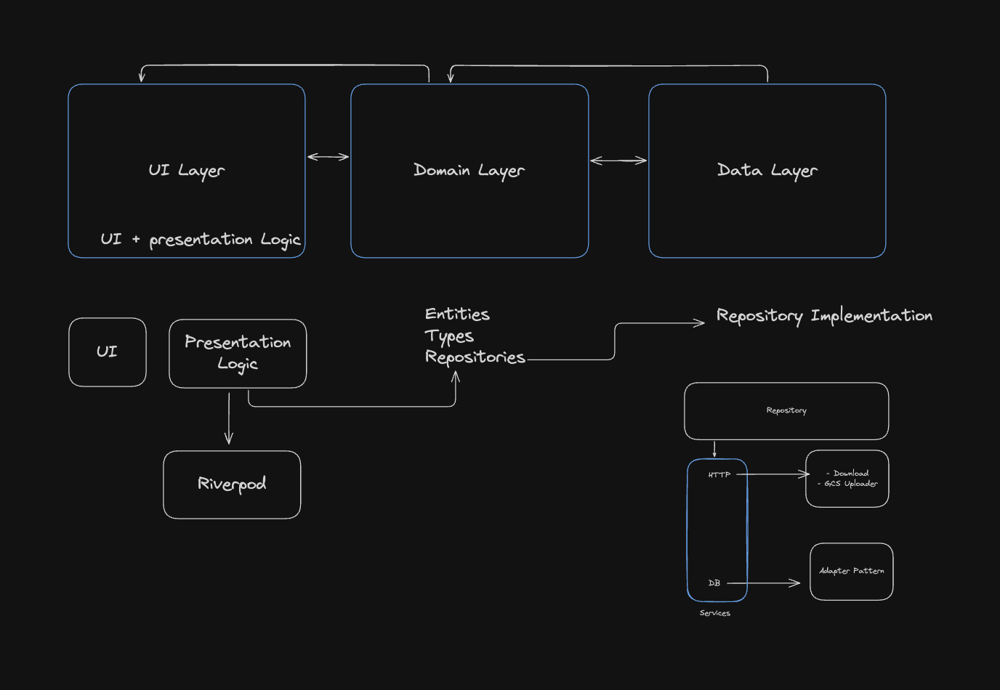
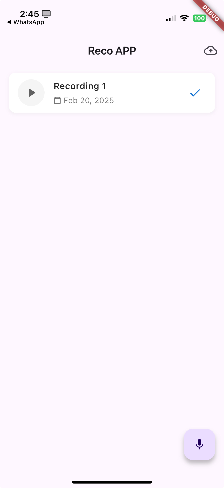
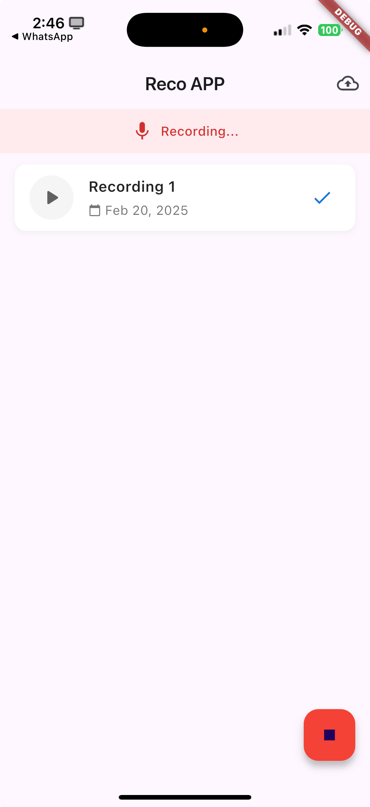

# Reco App

A modern Flutter application for recording and playing audio files.
Using some principles from clean architecture.

## ✨ Key Features

- 🎙️ Record audio files
- ▶️ Play audio files
- 📊 Recording visualization
- ⬆︎ Upload and download audio files to cloud storage

## 🏗️ Architecture

The project follows Clean Architecture principles with MVVM pattern and Riverpod for state management:

```
lib/
├── config/         # App configuration and constants
├── data/          # Data layer (repositories, data sources)
├── domain/        # Business logic and entities
├── provider/      # State management with Riverpod
└── ui/            # Presentation layer (screens, widgets)
```

### Architecture Overview



### Architecture Components

- **Domain Layer**
  - `AudioRecord`: Core entity representing recorded audio
  - `RecordingRepository`: Abstract definition of recording operations
  - `CloudStorageRepository`: Abstract definition of cloud storage operations

- **Data Layer**
  - `AudioRecordingRepository`: Implementation of recording operations
  - `MockDatabase`: Mock implementation of database operations
  - `CloudStorageService`: Handles cloud storage operations

- **Provider Layer**
  - `AppPlayer`: Manages audio playback state and controls
  - `AppRecorder`: Handles recording state and file operations
  - `AppUploader`: Manages upload state and operations

- **UI Layer**
  - `AudioRecorderView`: Main recording interface
  - `UploaderBottomSheet`: Displays upload progress


## 🛠️ Technologies Used

### Core
- **Flutter**: ^3.19.0
- **Dart**: ^3.0.0

### State Management
- **Riverpod**: State management with code generation

### Audio Processing
- **record**:  (Audio recording with high-quality settings)
- **audioplayers**:  (Advanced audio playback features)

### Storage & Permissions
- **path_provider**:  (File system management)
- **permission_handler**:  (Runtime permissions)

### Utilities
- **intl**:  (Internationalization)
- **uuid**:  (Unique identifiers)


### Remote Operations
- **googleapis**:  (Google Cloud API client)
- **googleapis_auth**: (Google Cloud API authentication)
- **gcloud**:  (Google Cloud SDK)
- **http**:  (HTTP client)

## 🚀 Getting Started

### Prerequisites

- Flutter SDK (>=3.24.3)
- Copy credentials.json to credentials folder

### Installation

1. Clone the repository:
```bash
git clone https://github.com/yourusername/reco_app.git
cd reco_app
```

2. Install dependencies:
```bash
flutter pub get
```

3. Generate required files:
```bash
flutter pub run build_runner build -d
```

4. Run the app:
```bash
flutter run
```

## 📱 Usage Guide

### Recording Audio
1. Launch the app and grant necessary permissions
2. Tap the microphone button to start recording
3. Tap the stop button to finish and save the recording

### Managing Recordings
1. View all recordings in the main list
2. Tap any recording to:
   - Play/pause audio
   - Upload the recording to cloud storage
   - Download the recording from cloud storage


### Misc
- You can see a message if is recording
- You can see a message what is the source of the audio file


### References Images






Also you have a video of the app in action: [Video.MP4](video.mp4)
